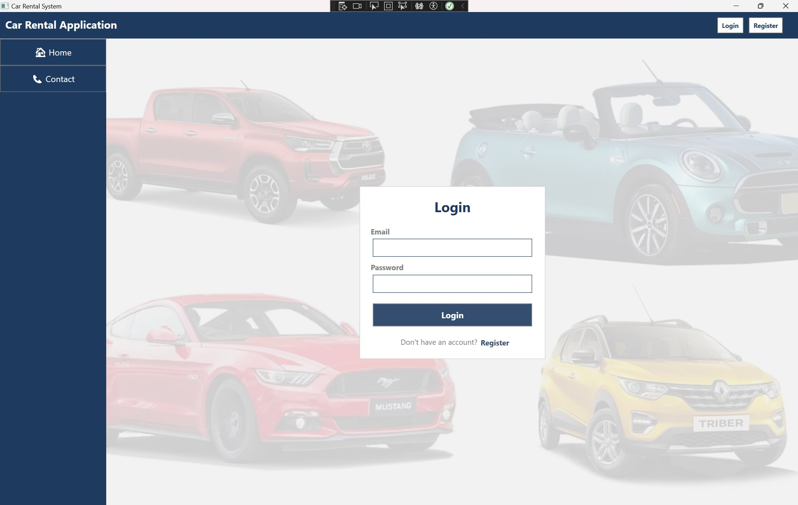
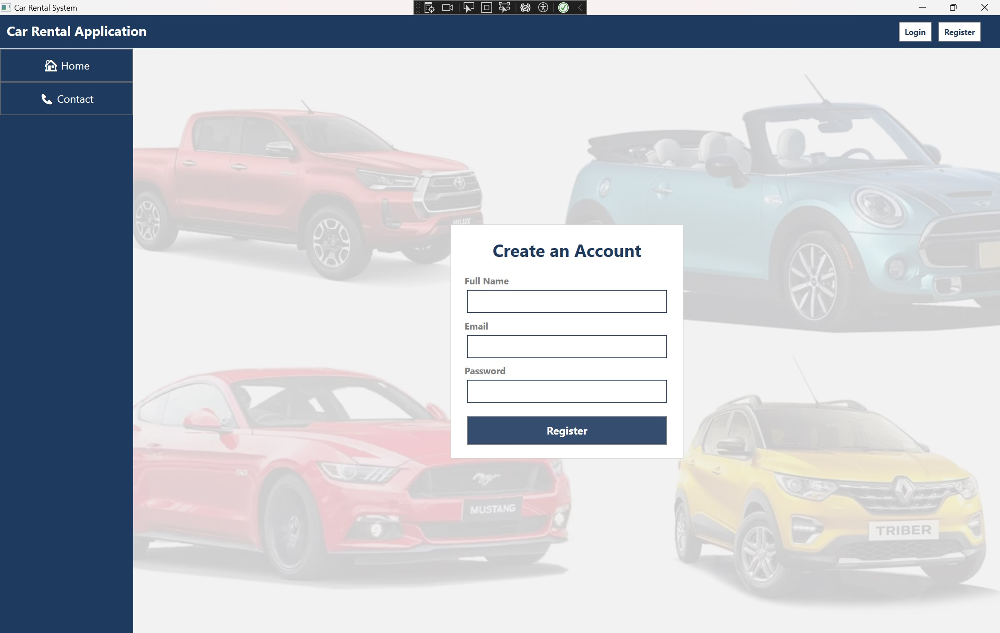
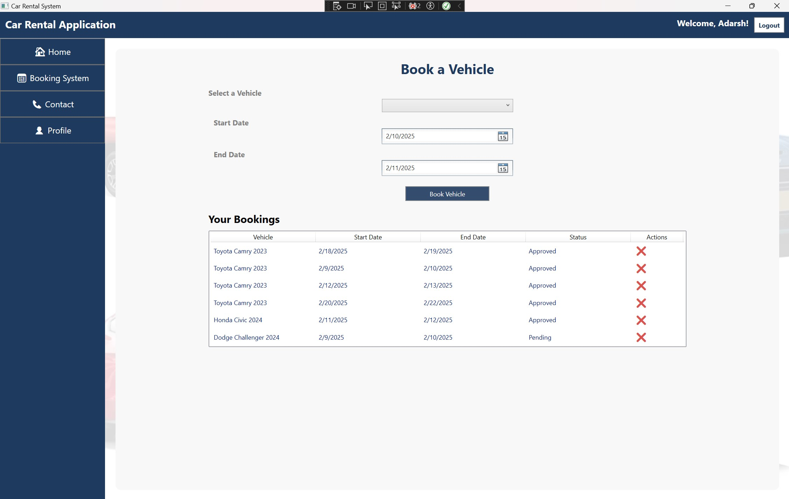
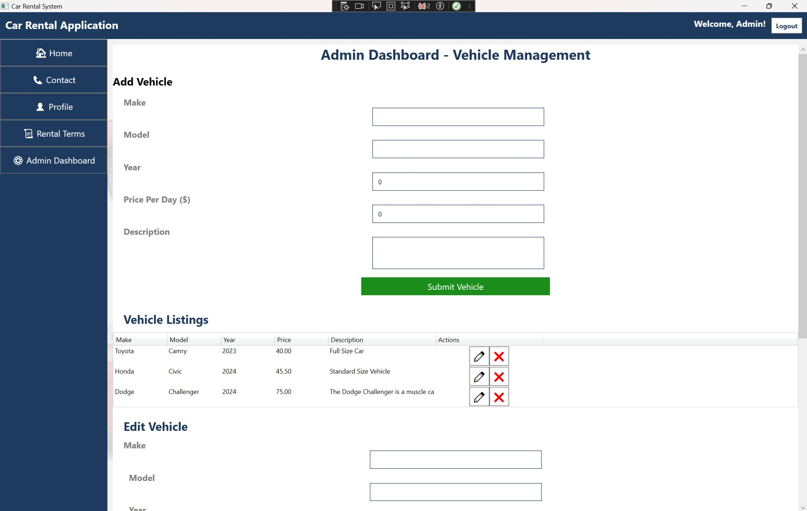
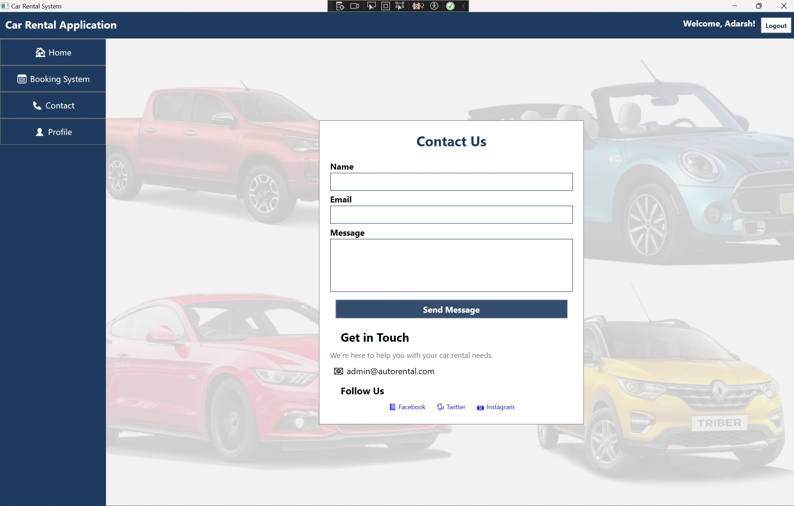
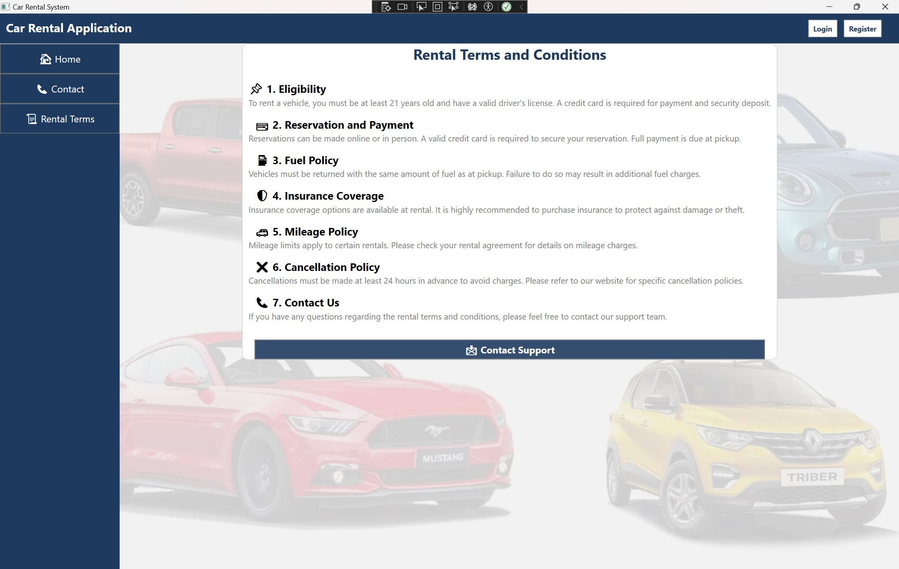

#  Car Rental Application (WPF MVVM)

##  Overview
The **Car Rental Application** is a **WPF MVVM**-based desktop application that allows users to **book rental cars**, manage bookings, and provides an **admin dashboard** for vehicle management.

---

##  Features
 **User Authentication** - Register & Login  
 **Booking System** - Users can book vehicles  
 **Admin Dashboard** - Manage vehicles, approve bookings  
 **Profile Management** - Users can view and update their bookings  
 **Database Integration** - Uses **SQL Server** with **Entity Framework Core**

---

##  Tech Stack
 **Frontend**: WPF (MVVM Pattern)
 **Backend**: C# (.NET Core)
 **Database**: SQL Server (EF Core)
 
 ---
 
 
##  Screenshots

### ** Login Page**

### ** Register Page**

### ** Home Page**

### ** Booking System**

### ** Admin Dashboard**

### ** Contact Page**

### ** Rental Terms**

### ** Profile Page**

---

